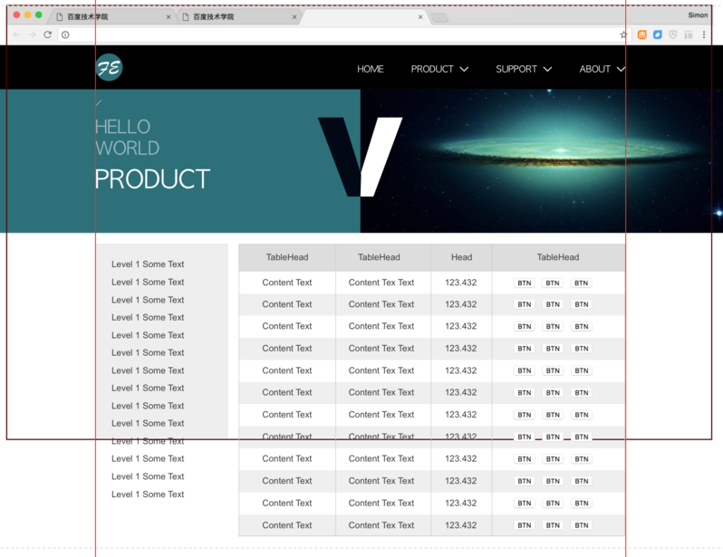
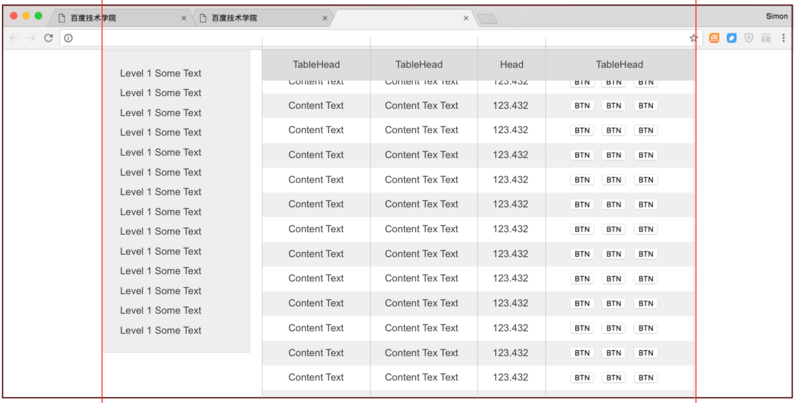

实验进度 24/66
任务24-27为一体，分4天完成
学习流程

编码学习

按照如下设计图及需求完成编码
Screenshot-0.png
图1
如图：
1. 黑色框和红色框均为参考线，非需要实现的边线。黑色框是表示浏览器窗口大小的一个大概示意。
2. 整个导航及banner和上一任务一致，可直接复用
3. 需要实现下方两个内容，左侧导航及右侧表格，表格单元格宽度自适应
4. 左侧导航的内容高度比浏览器的高度高，类似在图1的这种情况，左侧导航内部可以滚动，类似：http://echarts.baidu.com/examples.html
5. 右侧表格高度超过屏幕高度，滚动的时候，整页进行滚动。

6. 如图2，当浏览器整体滚动的时候，左侧导航会自适应增加高度，直至内容全部显示出来

7. 当浏览器滚动到表格表头的Top超出浏览器时，出现一个固定在浏览器窗口顶部的表头，表头各单元格宽度与内容表格各单元格宽度一致。
8. 不允许使用jQuery等组件或框架
阅读练习

JavaScript编码规范：https://github.com/ecomfe/spec/blob/master/javascript-style-guide.md
总结笔记

每天利用0.5小时的时间，在Teambition的分享中新增一篇笔记，完成一篇简要的学习笔记。
标题为：姓名_1/66学习笔记（例如：祖明_1/66学习笔记）
内容为：
本日新掌握的知识点：
有疑问的知识点：
心得体会：
完成任务

完成任务后，在任务中关联上自己的分享，并在任务中找到以自己名字命名的个人子任务，点勾表示完成。