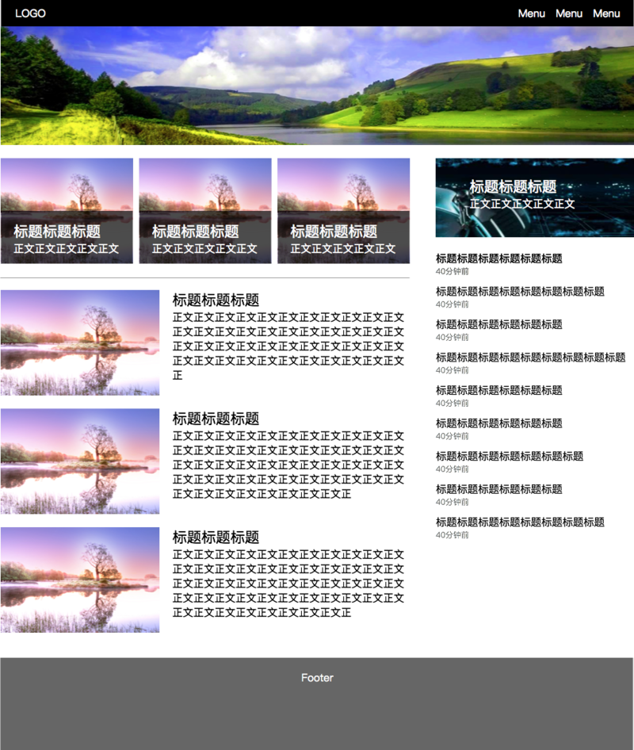
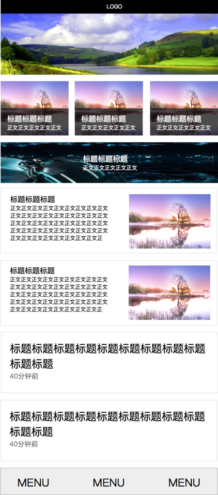

### 学习流程
### 新知识练习
结合前四天的学习，实现如下图的需求

1. 实现一个HTML，针对PC和移动端的示意图编写代码，实现响应式布局

2. 边距字号等不需要严格遵守，相似即可，颜色，图片可自行选择。

3. 需求分别用三种方式实现：(1)使用less, sass, stylus中的任意一种，(2)使用bootstrap，(3)纯CSS。建议按1-2-3的顺序分别实现。

学习知识点参考：

1. 响应式布局

2. media query

3. 深入理解px、em、rem等单位的使用场景及方法

4. 深入理解less, sass, stylus等css预处理器的作用，目标和意义

5. 尝试学习并应用栅格化

PC样式：

移动端样式，其中最下面的Menu是一直固定在页面最底部

### 交流练习
若有问题，积极主动和组内同学进行线上或线下的交流

基础练习及知识点整理
参考http://naotu.baidu.com/file/dddd6d42fba7687aeb620066aa0e9376?token=6f0cbf3e06ea4f46

在百度脑图中建立自己的前端知识学习树，并在笔记中分享给大家。

建立知识树的时候，尽量拆解到较细粒度的知识点，比如是某个CSS属性，也可以是某个属性的某个具体值（当这个值比较特殊或者非常重要时候），对于每个知识点打上是否清晰的掌握的记号，也可以在每个知识点后面加上看过的一些参考资料。

###  总结笔记
每天利用0.5小时的时间，在Teambition的分享中新增一篇笔记，完成一篇简要的学习笔记。

标题为：姓名_1/66学习笔记（例如：祖明_1/66学习笔记）

内容为：

本日新掌握的知识点：

有疑问的知识点：

心得体会：

### 完成任务
完成任务后，在任务中关联上自己的分享，并在任务中找到以自己名字命名的个人子任务，点勾表示完成。